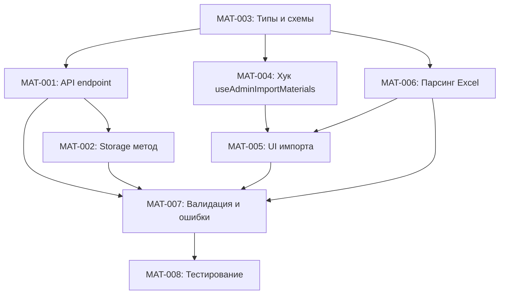

# План: Массовый импорт материалов из Excel

**Создан:** 2026-02-26  
**Оркестрация:** orch-2026-02-26-20-50-materials-import  
**Статус:** 🟢 Готов к выполнению

## Цель

Реализовать функционал массового импорта материалов из Excel-файла в глобальный справочник материалов (materials_catalog) в админ-панели. Функционал должен быть аналогичен существующему импорту работ (Works.tsx), с поддержкой режимов merge/replace, валидацией данных и отображением результатов.

## Контекст

- **Проект:** Telegram журнал работ (строительный учёт)
- **Существующий образец:** импорт работ в `Works.tsx` + `POST /api/works/import`
- **Целевая таблица:** `materials_catalog` (глобальный справочник)
- **Библиотека парсинга:** xlsx (уже используется в проекте)
- **Backend:** Express + Drizzle ORM + PostgreSQL
- **Frontend:** React + TanStack Query

## Формат Excel-файла

| Колонка | Название | Тип | Описание |
|---------|----------|-----|----------|
| A | № | number | Порядковый номер (игнорируется) |
| B | Наименование | string | **Обязательное поле** - название материала |
| C | Ед. изм. | string | Единица измерения (опционально) |
| D | ГОСТ/ТУ | string | Стандарт/ТУ (опционально) |
| E | Категория | string | material/equipment/product (опционально) |

**Примечания:**
- Первая строка с заголовками пропускается
- Строки без наименования игнорируются
- Дубликаты по наименованию обрабатываются согласно режиму (merge/replace)

## Задачи

### ⏳ MAT-001: Backend: API endpoint для импорта материалов

**Приоритет:** High  
**Время:** ~1 час  
**Зависимости:** Нет

**Описание:**
Создать API endpoint `POST /api/admin/materials-catalog/import` для приёма массива материалов и режима импорта.

**Детали реализации:**
- **Файл:** `server/routes.ts`
- **Endpoint:** `POST /api/admin/materials-catalog/import`
- **Middleware:** admin auth (проверка прав администратора)
- **Request body:**
  ```typescript
  {
    mode: "merge" | "replace",
    items: Array<{
      name: string;
      unit?: string;
      gostTu?: string;
      category?: "material" | "equipment" | "product";
    }>
  }
  ```
- **Response:**
  ```typescript
  {
    received: number;
    created: number;
    updated: number;
    skipped: number;
  }
  ```
- **Валидация:** использовать Zod-схему из `shared/routes.ts`
- **Обработка:** вызвать метод `storage.importMaterialsCatalog(items, mode)`

**Критерии приёмки:**
- ✅ Endpoint доступен только администраторам
- ✅ Валидация входных данных через Zod
- ✅ Возвращает статистику импорта
- ✅ Обработка ошибок с понятными сообщениями

---

### ⏳ MAT-002: Backend: Метод storage для массового импорта

**Приоритет:** High  
**Время:** ~1.5 часа  
**Зависимости:** MAT-001

**Описание:**
Реализовать метод `importMaterialsCatalog` в `server/storage.ts` для массового создания/обновления материалов в транзакции.

**Детали реализации:**
- **Файл:** `server/storage.ts`
- **Метод:** `async importMaterialsCatalog(items, mode): Promise<{created, updated, skipped}>`
- **Логика:**
  1. Если `mode === "replace"`: удалить все записи из `materials_catalog` (soft delete через `deletedAt`)
  2. Для каждого элемента:
     - Нормализовать `name` (trim, lowercase для сравнения)
     - Проверить существование по `name` (case-insensitive)
     - Если существует и `mode === "merge"`: обновить поля (unit, standardRef, category)
     - Если не существует: создать новую запись
  3. Вернуть статистику: `{created, updated, skipped}`
- **Транзакция:** весь импорт в одной DB-транзакции
- **Образец:** метод `importWorks` (строки 1223-1282 в storage.ts)

**Особенности:**
- Использовать `ilike` для case-insensitive поиска существующих материалов
- Пропускать пустые/невалидные записи (увеличивать счётчик `skipped`)
- В режиме `replace` сначала soft-delete всех материалов, затем вставка новых

**Критерии приёмки:**
- ✅ Импорт выполняется в транзакции
- ✅ Режим `merge` обновляет существующие записи
- ✅ Режим `replace` удаляет старые и создаёт новые
- ✅ Корректная статистика created/updated/skipped
- ✅ Case-insensitive сравнение по имени

---

### ⏳ MAT-003: Shared: Типы и схемы для импорта материалов

**Приоритет:** High  
**Время:** ~30 минут  
**Зависимости:** Нет

**Описание:**
Добавить Zod-схемы и TypeScript-типы для импорта материалов в `shared/routes.ts`.

**Детали реализации:**
- **Файл:** `shared/routes.ts`
- **Схемы:**
  ```typescript
  // Схема для одного материала при импорте
  const ImportMaterialItemSchema = z.object({
    name: z.string().min(1),
    unit: z.string().optional(),
    gostTu: z.string().optional(),
    category: z.enum(["material", "equipment", "product"]).optional(),
  });

  // Схема для запроса импорта
  const ImportMaterialsRequestSchema = z.object({
    mode: z.enum(["merge", "replace"]),
    items: z.array(ImportMaterialItemSchema),
  });

  // Схема для ответа
  const ImportMaterialsResponseSchema = z.object({
    received: z.number(),
    created: z.number(),
    updated: z.number(),
    skipped: z.number(),
  });
  ```
- **Экспорт типов:**
  ```typescript
  export type ImportMaterialItem = z.infer<typeof ImportMaterialItemSchema>;
  export type ImportMaterialsRequest = z.infer<typeof ImportMaterialsRequestSchema>;
  export type ImportMaterialsResponse = z.infer<typeof ImportMaterialsResponseSchema>;
  ```
- **Добавить в контракт API:**
  ```typescript
  "/api/admin/materials-catalog/import": {
    POST: {
      request: ImportMaterialsRequestSchema,
      response: ImportMaterialsResponseSchema,
    },
  },
  ```

**Критерии приёмки:**
- ✅ Zod-схемы для запроса и ответа
- ✅ TypeScript-типы экспортированы
- ✅ Добавлено в контракт API routes.ts
- ✅ Валидация обязательных полей (name)

---

### ⏳ MAT-004: Frontend: Хук useAdminImportMaterials

**Приоритет:** High  
**Время:** ~30 минут  
**Зависимости:** MAT-003

**Описание:**
Создать React Query хук для вызова API импорта материалов.

**Детали реализации:**
- **Файл:** `client/src/hooks/use-admin.ts`
- **Хук:**
  ```typescript
  export function useAdminImportMaterials() {
    const qc = useQueryClient();
    return useMutation({
      mutationFn: (data: ImportMaterialsRequest) =>
        adminMutate("POST", "/api/admin/materials-catalog/import", data)
          .then(res => res.json()),
      onSuccess: () => {
        qc.invalidateQueries({ queryKey: ["admin", "materials-catalog"] });
      },
    });
  }
  ```
- **Импорт типов:** `ImportMaterialsRequest, ImportMaterialsResponse` из `@shared/routes`
- **Инвалидация кэша:** после успешного импорта обновить список материалов

**Критерии приёмки:**
- ✅ Хук использует adminMutate для запроса
- ✅ Типизация request/response
- ✅ Инвалидация кэша материалов после импорта
- ✅ Возврат типизированного результата

---

### ⏳ MAT-005: Frontend: UI импорта в AdminMaterials.tsx

**Приоритет:** High  
**Время:** ~1 час  
**Зависимости:** MAT-004, MAT-006

**Описание:**
Добавить кнопку импорта и обработку результатов в интерфейс админ-панели материалов.

**Детали реализации:**
- **Файл:** `client/src/pages/admin/AdminMaterials.tsx`
- **UI элементы:**
  1. Кнопка "Импорт" с иконкой `FileUp` рядом с кнопкой "Добавить"
  2. Hidden file input для выбора Excel-файла
  3. Состояние загрузки (`isImporting`)
  4. Toast-уведомления с результатами
- **Обработчик:**
  ```typescript
  const handleFileUpload = async (event: React.ChangeEvent<HTMLInputElement>) => {
    const file = event.target.files?.[0];
    if (!file) return;

    setIsImporting(true);
    try {
      // Парсинг Excel (MAT-006)
      const items = await parseMaterialsExcel(file);
      
      // Импорт через API
      const result = await importMaterials.mutateAsync({
        mode: "merge", // или выбор пользователя
        items,
      });

      // Показать результат
      toast({
        title: "Импорт завершён",
        description: `Получено: ${result.received}. Создано: ${result.created}. Обновлено: ${result.updated}. Пропущено: ${result.skipped}.`,
      });
    } catch (error) {
      toast({
        title: "Ошибка импорта",
        description: error.message,
        variant: "destructive",
      });
    } finally {
      setIsImporting(false);
      event.target.value = "";
    }
  };
  ```
- **Режим импорта:** по умолчанию `merge` (можно добавить выбор через диалог)

**Критерии приёмки:**
- ✅ Кнопка импорта в toolbar
- ✅ Индикация загрузки при импорте
- ✅ Toast с детальной статистикой
- ✅ Обработка ошибок с понятными сообщениями
- ✅ Очистка input после импорта

---

### ⏳ MAT-006: Frontend: Парсинг Excel на клиенте

**Приоритет:** High  
**Время:** ~1 час  
**Зависимости:** MAT-003

**Описание:**
Создать функцию парсинга Excel-файла материалов на клиенте (аналогично Works.tsx).

**Детали реализации:**
- **Файл:** `client/src/lib/materialsParser.ts` (новый)
- **Функция:**
  ```typescript
  import * as XLSX from "xlsx";
  import type { ImportMaterialItem } from "@shared/routes";

  export async function parseMaterialsExcel(file: File): Promise<ImportMaterialItem[]> {
    const buffer = await file.arrayBuffer();
    const data = new Uint8Array(buffer);
    
    const workbook = XLSX.read(data, { type: "array" });
    const firstSheet = workbook.Sheets[workbook.SheetNames[0]];
    const rows = XLSX.utils.sheet_to_json(firstSheet, { header: 1 }) as any[][];

    const items: ImportMaterialItem[] = [];
    let skippedCount = 0;

    for (const row of rows) {
      if (!Array.isArray(row) || row.length < 2) {
        skippedCount++;
        continue;
      }

      // Пропустить заголовок (если первая строка содержит "№", "Наименование" и т.д.)
      if (row[0] === "№" || row[1] === "Наименование") {
        skippedCount++;
        continue;
      }

      const name = String(row[1] ?? "").trim();
      const unit = String(row[2] ?? "").trim();
      const gostTu = String(row[3] ?? "").trim();
      const category = String(row[4] ?? "").trim().toLowerCase();

      if (!name) {
        skippedCount++;
        continue;
      }

      items.push({
        name,
        unit: unit || undefined,
        gostTu: gostTu || undefined,
        category: ["material", "equipment", "product"].includes(category)
          ? category as any
          : undefined,
      });
    }

    if (items.length === 0) {
      throw new Error("В файле не найдено подходящих строк для импорта");
    }

    return items;
  }
  ```
- **Валидация:**
  - Проверка формата файла (xlsx/xls)
  - Проверка наличия листов
  - Пропуск пустых строк и заголовков
  - Обязательное поле: `name`

**Критерии приёмки:**
- ✅ Парсинг Excel с библиотекой xlsx
- ✅ Пропуск заголовков и пустых строк
- ✅ Валидация обязательного поля (name)
- ✅ Обработка ошибок парсинга
- ✅ Возврат типизированного массива ImportMaterialItem[]

---

### ⏳ MAT-007: Валидация и обработка ошибок

**Приоритет:** Medium  
**Время:** ~45 минут  
**Зависимости:** MAT-001, MAT-002, MAT-005, MAT-006

**Описание:**
Добавить комплексную валидацию данных и обработку ошибок на всех уровнях.

**Детали реализации:**

**Backend (server/routes.ts):**
- Валидация через Zod-схему перед вызовом storage
- Проверка прав администратора
- Обработка ошибок транзакции БД
- Возврат понятных HTTP-кодов:
  - 400 - невалидные данные
  - 401 - не авторизован
  - 403 - не администратор
  - 500 - ошибка сервера

**Backend (server/storage.ts):**
- Try-catch вокруг транзакции
- Логирование ошибок БД
- Rollback при ошибках
- Валидация длины строк (name <= 500 символов)

**Frontend (materialsParser.ts):**
- Проверка типа файла (.xlsx, .xls)
- Проверка размера файла (< 10MB)
- Проверка наличия данных
- Понятные сообщения об ошибках на русском

**Frontend (AdminMaterials.tsx):**
- Обработка ошибок парсинга
- Обработка ошибок API
- Toast-уведомления с деталями
- Сброс состояния после ошибки

**Критерии приёмки:**
- ✅ Валидация на клиенте и сервере
- ✅ Понятные сообщения об ошибках
- ✅ Rollback транзакции при ошибках
- ✅ Логирование ошибок на сервере
- ✅ Graceful degradation в UI

---

### ⏳ MAT-008: Интеграционное тестирование

**Приоритет:** Medium  
**Время:** ~1 час  
**Зависимости:** MAT-001, MAT-002, MAT-003, MAT-004, MAT-005, MAT-006, MAT-007

**Описание:**
Протестировать полный цикл импорта материалов от UI до БД.

**Тестовые сценарии:**

1. **Успешный импорт (merge):**
   - Создать тестовый Excel с 5 материалами
   - Импортировать через UI
   - Проверить создание записей в БД
   - Повторить импорт с изменениями
   - Проверить обновление существующих записей

2. **Успешный импорт (replace):**
   - Создать начальные данные в БД
   - Импортировать новый файл в режиме replace
   - Проверить удаление старых и создание новых записей

3. **Обработка ошибок:**
   - Файл без обязательных полей → toast с ошибкой
   - Невалидный формат файла → toast с ошибкой
   - Пустой файл → toast "не найдено строк"
   - Дубликаты в файле → корректная обработка

4. **Граничные случаи:**
   - Очень длинное название (> 500 символов) → обрезка/ошибка
   - Спецсимволы в названии → корректная обработка
   - Пустые ячейки в опциональных полях → null/undefined

5. **Производительность:**
   - Импорт 100 материалов → < 3 секунд
   - Импорт 1000 материалов → < 10 секунд

**Критерии приёмки:**
- ✅ Все тестовые сценарии проходят успешно
- ✅ Нет утечек памяти при больших файлах
- ✅ Корректная обработка всех ошибок
- ✅ UI остаётся отзывчивым во время импорта
- ✅ Статистика импорта соответствует реальным данным

---

## Зависимости задач



## Порядок выполнения

**Рекомендуемая последовательность:**

1. **Фаза 1: Контракт и типы** (параллельно)
   - MAT-003: Типы и схемы

2. **Фаза 2: Backend** (последовательно)
   - MAT-001: API endpoint
   - MAT-002: Storage метод

3. **Фаза 3: Frontend** (параллельно после фазы 2)
   - MAT-004: Хук useAdminImportMaterials
   - MAT-006: Парсинг Excel
   - MAT-005: UI импорта (после MAT-004 и MAT-006)

4. **Фаза 4: Качество** (последовательно)
   - MAT-007: Валидация и обработка ошибок
   - MAT-008: Интеграционное тестирование

**Общее время:** ~7 часов

## Архитектурные решения

### 1. Парсинг на клиенте vs сервере
**Решение:** Парсинг на клиенте (как в Works.tsx)
**Обоснование:**
- Снижение нагрузки на сервер
- Быстрая обратная связь пользователю
- Библиотека xlsx уже используется в проекте
- Валидация данных до отправки на сервер

### 2. Режимы импорта
**Решение:** Поддержка merge и replace
**Обоснование:**
- `merge` - безопасное добавление/обновление (по умолчанию)
- `replace` - полная замена справочника (для миграций)
- Аналогично импорту работ

### 3. Идентификация дубликатов
**Решение:** Case-insensitive сравнение по полю `name`
**Обоснование:**
- Наименование - естественный уникальный идентификатор
- Case-insensitive избегает дубликатов типа "Бетон" и "бетон"
- Простота реализации через `ilike` в Drizzle

### 4. Транзакционность
**Решение:** Весь импорт в одной DB-транзакции
**Обоснование:**
- Атомарность операции (всё или ничего)
- Откат при ошибках
- Консистентность данных

### 5. Soft delete vs hard delete
**Решение:** Soft delete через `deletedAt` в режиме replace
**Обоснование:**
- Возможность восстановления данных
- Аудит изменений
- Соответствие архитектуре проекта

## Риски и ограничения

### Риски:
1. **Большие файлы:** Парсинг > 5000 строк может замедлить браузер
   - **Митигация:** Ограничение размера файла, показ прогресса
   
2. **Дубликаты в файле:** Несколько строк с одинаковым названием
   - **Митигация:** Последняя запись побеждает (как в Works)

3. **Конфликты при параллельном импорте:** Два админа импортируют одновременно
   - **Митигация:** Транзакции БД, последний импорт побеждает

### Ограничения:
1. Формат Excel строго определён (5 колонок)
2. Только администраторы могут импортировать
3. Нет предпросмотра перед импортом (можно добавить в будущем)
4. Нет истории импортов (можно добавить логирование)

## Будущие улучшения

1. **Предпросмотр импорта:**
   - Показать таблицу с данными перед импортом
   - Возможность редактирования перед сохранением

2. **Экспорт в Excel:**
   - Выгрузка текущего справочника в Excel
   - Шаблон для импорта

3. **История импортов:**
   - Логирование всех импортов (кто, когда, сколько записей)
   - Возможность отката импорта

4. **Прогресс-бар:**
   - Показ прогресса при больших файлах
   - Отмена импорта

5. **Расширенная валидация:**
   - Проверка ГОСТ/ТУ на соответствие формату
   - Предложения по единицам измерения

## Связанные файлы

**Backend:**
- `server/routes.ts` - API endpoints
- `server/storage.ts` - методы работы с БД
- `server/middleware/telegramAuth.ts` - проверка прав администратора

**Frontend:**
- `client/src/pages/admin/AdminMaterials.tsx` - UI админ-панели
- `client/src/hooks/use-admin.ts` - React Query хуки
- `client/src/lib/materialsParser.ts` - парсинг Excel (новый файл)

**Shared:**
- `shared/routes.ts` - контракт API, типы, схемы
- `shared/schema.ts` - схема БД (materials_catalog)

**Образцы:**
- `client/src/pages/Works.tsx` - импорт работ (референс)
- `client/src/lib/estimateParser.ts` - парсинг сметы (референс)

## Метрики успеха

- ✅ Импорт 100 материалов занимает < 3 секунд
- ✅ Все обязательные поля валидируются
- ✅ Режимы merge и replace работают корректно
- ✅ Toast-уведомления показывают детальную статистику
- ✅ Нет ошибок в консоли браузера
- ✅ Нет ошибок в логах сервера
- ✅ Код соответствует стилю проекта (TypeScript strict mode)
- ✅ Документация обновлена (если требуется)
