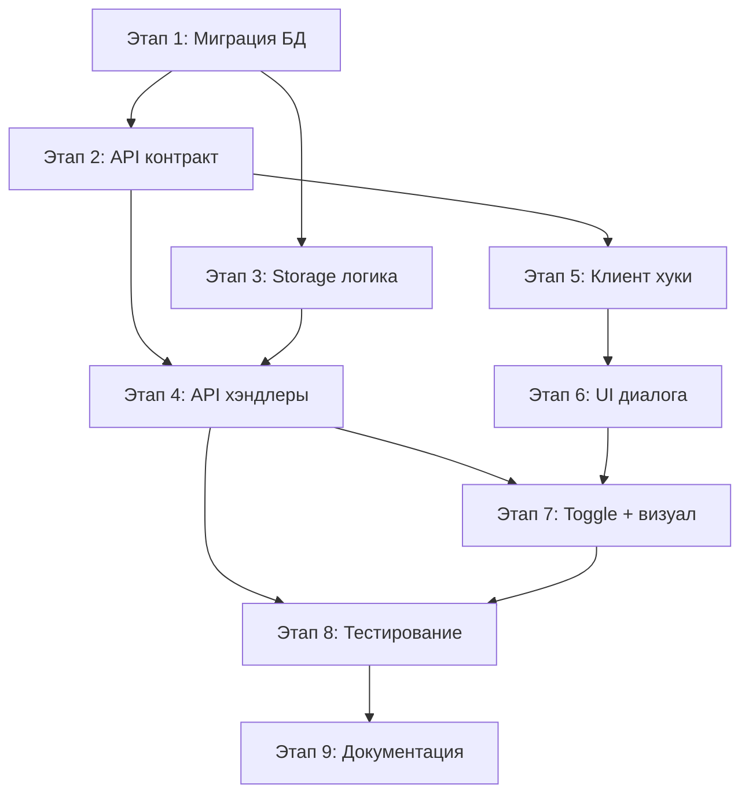

# План: Split Task Feature (Разделение задач графика)

**Создан:** 2026-03-02  
**Orchestration:** orch-2026-03-02-03-58-split-task  
**Статус:** 🟢 Готов к выполнению  
**Приоритет:** Высокий (бизнес-функциональность)

---

## Цель

Реализовать функциональность разделения задачи графика (полосы Ганта) на две и более последовательных задач ("захватки") с независимыми сроками и актами. Материалы и документация наследуются при разделении по выбору и синхронизируются по toggle-режиму при добавлении новых.

---

## Обзор

Функция Split Task позволяет:
- Разбивать одну задачу графика на несколько последовательных частей
- Распределять объёмы работ между частями
- Назначать каждой части свой номер акта
- Наследовать материалы и документацию при разделении
- Управлять синхронизацией материалов/документации через toggle "Независимые материалы"
- Множественное разделение: разделённая задача может быть разделена снова

---

## Ключевые концепции

### Split Group
Группа связанных задач-сиблингов, созданных путём разделения:
- `split_group_id` (UUID) связывает все задачи группы
- `split_index` (0, 1, 2...) определяет порядок
- Каждая задача имеет свой `actNumber` → свой акт

### Toggle "Независимые материалы"
Управляет поведением при добавлении/удалении материалов и документации:

**OFF (`independentMaterials = false`, по умолчанию):**
- Добавление материала/документации → автоматически копируется во все задачи группы с `false`
- Удаление → каскадирует на всю группу
- "Общие" материалы на все захватки

**ON (`independentMaterials = true`):**
- Добавление/удаление затрагивает только эту задачу
- "Свои" материалы для этой захватки

---

## Архитектурные решения

### Модель данных
Новые поля в `schedule_tasks`:
- `split_group_id TEXT` — UUID, связывающий сиблингов
- `split_index INTEGER` — порядок в группе (0, 1, 2...)
- `independent_materials BOOLEAN NOT NULL DEFAULT FALSE` — режим sync/изоляция

### API Design
**REST endpoints:**
- `POST /api/schedule-tasks/:id/split` — разделить задачу
- `GET /api/schedule-tasks/:id/split-siblings` — получить все сиблинги
- `PATCH /api/schedule-tasks/:id` — обновить (включая toggle)

### Синхронизация
**Материалы (`task_materials`):**
- При добавлении/удалении → каскадирование на сиблингов с `independentMaterials = false`
- Транзакционная целостность через unique constraint

**Документация (`projectDrawings`, `normativeRefs`, `executiveSchemes`):**
- При PATCH задачи → синхронизация полей на сиблингов с `false`

### UI/UX
- Диалог Split Task с выбором даты, объёмов, наследования
- Badge "X/Y" на задачах-захватках
- Единый цвет полос Ганта для группы
- Toggle в редактировании задачи
- Информативные подсказки о режиме sync

---

## Задачи по этапам

### Этап 1: Миграция БД — новые поля в `schedule_tasks`
**Статус:** ⏳ Не начата  
**Оценка:** 1-2 часа  
**Приоритет:** Высокий

#### Задачи:
- [ ] **SPLIT-001**: Написать SQL миграцию `migrations/00XX_add_split_fields.sql`
  - Добавить колонки `split_group_id`, `split_index`, `independent_materials`
  - Создать индекс `schedule_tasks_split_group_idx`
  - Добавить комментарии к колонкам
  - **Файлы:** `migrations/00XX_add_split_fields.sql`

- [ ] **SPLIT-002**: Обновить Drizzle схему `shared/schema.ts`
  - Добавить три новые колонки в `scheduleTasks` table
  - Обновить индексы (добавить `splitGroupIdx`)
  - **Файлы:** `shared/schema.ts`
  - **Зависит от:** SPLIT-001

- [ ] **SPLIT-003**: Обновить Zod-типы
  - Убедиться, что `InsertScheduleTask` / `ScheduleTask` включают новые поля
  - Проверить автогенерацию через `createInsertSchema`
  - **Файлы:** `shared/schema.ts`
  - **Зависит от:** SPLIT-002

- [ ] **SPLIT-004**: Применить миграцию и проверить
  - Выполнить `npm run db:migrate`
  - Проверить: колонки созданы, существующие задачи имеют `split_group_id = NULL`
  - **Зависит от:** SPLIT-003

**Критерии приёмки этапа 1:**
- ✅ Новые колонки в БД
- ✅ Drizzle-схема синхронизирована
- ✅ Обратная совместимость (nullable / default)

---

### Этап 2: API-контракт — определение маршрутов в `shared/routes.ts`
**Статус:** ⏳ Не начата  
**Оценка:** 1-2 часа  
**Приоритет:** Высокий

#### Задачи:
- [ ] **SPLIT-005**: Добавить маршрут `scheduleTasks.split`
  - Определить input schema (splitDate, quantityFirst/Second, newActNumber, inherit)
  - Определить responses (200, 400, 404, 409)
  - **Файлы:** `shared/routes.ts`
  - **Зависит от:** SPLIT-004

- [ ] **SPLIT-006**: Расширить `scheduleTasks.patch` input
  - Добавить `independentMaterials: z.boolean().optional()`
  - **Файлы:** `shared/routes.ts`
  - **Зависит от:** SPLIT-004

- [ ] **SPLIT-007**: Добавить маршрут `splitSiblings`
  - `GET /api/schedule-tasks/:id/split-siblings`
  - Response: массив задач-сиблингов
  - **Файлы:** `shared/routes.ts`
  - **Зависит от:** SPLIT-004

- [ ] **SPLIT-008**: Проверить `scheduleTaskSchema` включает новые поля
  - Убедиться, что ответы API содержат `splitGroupId`, `splitIndex`, `independentMaterials`
  - **Файлы:** `shared/routes.ts`
  - **Зависит от:** SPLIT-007

**Критерии приёмки этапа 2:**
- ✅ Типизированный контракт API для split, patch, siblings
- ✅ Валидация входных данных через Zod

---

### Этап 3: Storage — серверная логика разделения
**Статус:** ⏳ Не начата  
**Оценка:** 3-4 часа  
**Приоритет:** Высокий (критический путь)

#### Задачи:
- [ ] **SPLIT-009**: Реализовать метод `splitScheduleTask(taskId, params)` в `DatabaseStorage`
  - **Алгоритм:**
    1. Получить исходную задачу (404 если нет)
    2. Валидация: splitDate внутри диапазона, объёмы корректны
    3. Вычислить durationFirst, durationSecond
    4. Определить splitGroupId (существующий или новый UUID)
    5. Определить splitIndex для новой задачи
    6. Транзакция:
       - UPDATE исходную задачу (duration, quantity, splitGroupId, splitIndex)
       - Сдвинуть orderIndex для задач ниже
       - INSERT новую задачу (со всеми полями)
       - Если inherit.materials = true → копировать task_materials
    7. Вернуть обе задачи
  - **Файлы:** `server/storage.ts`
  - **Зависит от:** SPLIT-008

- [ ] **SPLIT-010**: Реализовать метод `getSplitSiblings(taskId)`
  - Получить задачу → её splitGroupId
  - SELECT всех сиблингов с ORDER BY split_index
  - **Файлы:** `server/storage.ts`
  - **Зависит от:** SPLIT-009

- [ ] **SPLIT-011**: Обновить `patchScheduleTask`
  - Добавить поддержку поля `independentMaterials`
  - **Файлы:** `server/storage.ts`
  - **Зависит от:** SPLIT-010

- [ ] **SPLIT-012**: Реализовать `syncMaterialsAcrossSplitGroup(taskId, newMaterials)`
  - Вызывается при добавлении материала через POST materials
  - Условие: task.splitGroupId != null AND task.independentMaterials = false
  - Найти сиблингов с independentMaterials = false
  - INSERT материал в сиблингов (если ещё нет)
  - Unique constraint обеспечивает целостность
  - **Файлы:** `server/storage.ts`
  - **Зависит от:** SPLIT-011

- [ ] **SPLIT-013**: Реализовать `syncMaterialDeleteAcrossSplitGroup(taskId, materialId)`
  - Аналогично удалению — каскадировать на сиблингов
  - **Файлы:** `server/storage.ts`
  - **Зависит от:** SPLIT-012

- [ ] **SPLIT-014**: Реализовать `syncDocsAcrossSplitGroup(taskId, docFields)`
  - Вызывается при PATCH задачи с изменением projectDrawings/normativeRefs/executiveSchemes
  - Условие: splitGroupId != null AND independentMaterials = false
  - UPDATE сиблингов с independentMaterials = false
  - **Файлы:** `server/storage.ts`
  - **Зависит от:** SPLIT-013

**Критерии приёмки этапа 3:**
- ✅ Полная серверная логика split + sync
- ✅ Транзакционная целостность
- ✅ Корректная обработка splitGroupId и splitIndex

---

### Этап 4: API-хэндлеры — `server/routes.ts`
**Статус:** ⏳ Не начата  
**Оценка:** 3-4 часа  
**Приоритет:** Высокий

#### Задачи:
- [ ] **SPLIT-015**: Реализовать хэндлер `POST /api/schedule-tasks/:id/split`
  - Парсинг и валидация input
  - Проверка splitDate в диапазоне задачи
  - Проверка конфликта actNumber (409 если занят)
  - Вызов storage.splitScheduleTask
  - Возврат результата (original + created)
  - **Файлы:** `server/routes.ts`
  - **Зависит от:** SPLIT-014

- [ ] **SPLIT-016**: Реализовать хэндлер `GET /api/schedule-tasks/:id/split-siblings`
  - Вызов storage.getSplitSiblings
  - Возврат массива задач-сиблингов
  - **Файлы:** `server/routes.ts`
  - **Зависит от:** SPLIT-015

- [ ] **SPLIT-017**: Обновить хэндлер `PATCH /api/schedule-tasks/:id`
  - Поддержка independentMaterials в patch
  - При изменении projectDrawings/normativeRefs/executiveSchemes:
    - Проверить splitGroupId и independentMaterials
    - Вызвать syncDocsAcrossSplitGroup если нужно
  - **Файлы:** `server/routes.ts`
  - **Зависит от:** SPLIT-016

- [ ] **SPLIT-018**: Обновить хэндлер `POST /api/schedule-tasks/:id/materials` (добавление)
  - После добавления: проверить splitGroupId и independentMaterials
  - Вызвать syncMaterialsAcrossSplitGroup если нужно
  - **Файлы:** `server/routes.ts`
  - **Зависит от:** SPLIT-017

- [ ] **SPLIT-019**: Обновить хэндлер `DELETE /api/schedule-tasks/:id/materials/:materialId`
  - Вызвать syncMaterialDeleteAcrossSplitGroup если нужно
  - **Файлы:** `server/routes.ts`
  - **Зависит от:** SPLIT-018

- [ ] **SPLIT-020**: Обновить хэндлер `PUT /api/schedule-tasks/:id/materials` (полная замена)
  - При independentMaterials = false: синхронизировать итоговый набор
  - Добавить недостающие в сиблингов
  - Удалить те, что были убраны (только у сиблингов с false)
  - Не затрагивать материалы сиблингов с true
  - **Файлы:** `server/routes.ts`
  - **Зависит от:** SPLIT-019

**Критерии приёмки этапа 4:**
- ✅ API полностью функционален
- ✅ Синхронизация работает при всех операциях
- ✅ Корректная обработка ошибок (400, 404, 409)

---

### Этап 5: Клиент — хуки и утилиты
**Статус:** ⏳ Не начата  
**Оценка:** 2-3 часа  
**Приоритет:** Средний

#### Задачи:
- [ ] **SPLIT-021**: Создать хук `useSplitScheduleTask` в `use-schedules.ts`
  - Mutation для вызова POST /api/schedule-tasks/:id/split
  - Инвалидация queries после успешного split
  - **Файлы:** `client/src/hooks/use-schedules.ts`
  - **Зависит от:** SPLIT-008

- [ ] **SPLIT-022**: Создать хук `useSplitSiblings(taskId)`
  - Query для получения сиблингов
  - **Файлы:** `client/src/hooks/use-schedules.ts`
  - **Зависит от:** SPLIT-021

- [ ] **SPLIT-023**: Обновить `usePatchScheduleTask`
  - Убедиться, что independentMaterials передаётся в patch
  - Инвалидация siblings при patch задачи из split-группы
  - **Файлы:** `client/src/hooks/use-schedules.ts`
  - **Зависит от:** SPLIT-022

- [ ] **SPLIT-024**: Обновить типы `ScheduleTask` на клиенте
  - Добавить splitGroupId, splitIndex, independentMaterials
  - (если типы определены отдельно от shared)
  - **Файлы:** `client/src/types/` (если есть)
  - **Зависит от:** SPLIT-023

**Критерии приёмки этапа 5:**
- ✅ React Query хуки для split API
- ✅ Типы синхронизированы с shared
- ✅ Инвалидация queries корректна

---

### Этап 6: Клиент — UI диалога разделения
**Статус:** ⏳ Не начата  
**Оценка:** 4-6 часов  
**Приоритет:** Средний

#### Задачи:
- [ ] **SPLIT-025**: Создать компонент `SplitTaskDialog.tsx`
  - Props: task, open, onClose, scheduleId
  - UI элементы:
    - DatePicker для даты разделения (валидация: внутри диапазона)
    - Input для объёма части 1 (auto-вычисление части 2)
    - Input для номера акта части 2
    - Checkboxes наследования (материалы, документация)
  - Логика:
    - quantitySecond = totalQuantity - quantityFirst
    - Валидация: splitDate в диапазоне, объёмы > 0
    - Submit → useSplitScheduleTask
    - Toast "Задача разделена"
  - **Файлы:** `client/src/components/schedule/SplitTaskDialog.tsx`
  - **Зависит от:** SPLIT-024

- [ ] **SPLIT-026**: Добавить кнопку "Разделить" в `Schedule.tsx`
  - Иконка Scissors (lucide-react)
  - Рядом с ChevronLeft/Right или в dropdown MoreVertical
  - onClick → открыть SplitTaskDialog
  - **Файлы:** `client/src/pages/Schedule.tsx`
  - **Зависит от:** SPLIT-025

- [ ] **SPLIT-027**: Интегрировать SplitTaskDialog в `Schedule.tsx`
  - Состояние: `const [splitTask, setSplitTask] = useState<ScheduleTask | null>(null)`
  - Передача props: task={splitTask}, open={!!splitTask}, onClose={...}
  - **Файлы:** `client/src/pages/Schedule.tsx`
  - **Зависит от:** SPLIT-026

- [ ] **SPLIT-028**: Обработка ошибок в диалоге split
  - 400 (splitDate вне диапазона) → сообщение у поля даты
  - 409 (конфликт actNumber) → сообщение у поля номера акта
  - Toast с ошибкой при других кодах
  - **Файлы:** `client/src/components/schedule/SplitTaskDialog.tsx`
  - **Зависит от:** SPLIT-027

**Критерии приёмки этапа 6:**
- ✅ Полноценный UI для разделения задачи
- ✅ Валидация входных данных
- ✅ Корректная обработка ошибок

---

### Этап 7: Клиент — Toggle "Независимые материалы" и визуальная индикация
**Статус:** ⏳ Не начата  
**Оценка:** 3-4 часа  
**Приоритет:** Средний

#### Задачи:
- [ ] **SPLIT-029**: Добавить Toggle "Независимые материалы" в диалоге редактирования задачи
  - Показывать только если task.splitGroupId != null
  - Switch/Checkbox: "Независимые материалы и документация"
  - Tooltip: пояснение режима sync
  - onChange → patchTask({ independentMaterials: value })
  - **Файлы:** `client/src/pages/Schedule.tsx` (секция редактирования ~строки 422-673)
  - **Зависит от:** SPLIT-028

- [ ] **SPLIT-030**: Добавить Badge "захватка X из Y" на задаче в списке
  - Если task.splitGroupId != null:
    - Определить позицию: task.splitIndex + 1 из N (кол-во сиблингов)
    - Показать badge: `<Badge variant="outline">1/3</Badge>` рядом с названием
  - **Файлы:** `client/src/pages/Schedule.tsx`
  - **Зависит от:** SPLIT-029

- [ ] **SPLIT-031**: Визуальная связь на Ганте (цвет, коннекторы)
  - Задачи одной splitGroupId — одинаковый цвет полосы (hash splitGroupId)
  - Между полосами — пунктирная линия-коннектор (SVG или CSS)
  - При наведении на полосу — подсветить все сиблинги
  - **Файлы:** `client/src/pages/Schedule.tsx` (Gantt render)
  - **Зависит от:** SPLIT-030

- [ ] **SPLIT-032**: Индикатор режима материалов в `TaskMaterialsEditor`
  - Если independentMaterials = false → "Материалы синхронизируются с N захваткам(и)"
  - Если independentMaterials = true → "Материалы только для этой захватки"
  - **Файлы:** `client/src/components/schedule/TaskMaterialsEditor.tsx`
  - **Зависит от:** SPLIT-031

- [ ] **SPLIT-033**: Пометки для полей документации
  - В секциях projectDrawings, normativeRefs, executiveSchemes:
    - Если task в split-группе и independentMaterials = false → "Изменения применятся ко всем захваткам"
  - **Файлы:** `client/src/pages/Schedule.tsx` (секция редактирования)
  - **Зависит от:** SPLIT-032

**Критерии приёмки этапа 7:**
- ✅ UX понятен: видна связь между захватками
- ✅ Toggle управляет режимом sync
- ✅ Информативные подсказки при редактировании
- ✅ Визуальная индикация на Ганте

---

### Этап 8: Тестирование и edge cases
**Статус:** ⏳ Не начата  
**Оценка:** 2-3 часа  
**Приоритет:** Высокий (качество)

#### Задачи:
- [ ] **SPLIT-034**: Тест: Базовый split
  - Задача без split → разделить → две задачи
  - Проверить: даты, объёмы, orderIndex, splitGroupId, splitIndex
  - Проверить: генерация актов (два отдельных акта)
  - **Зависит от:** SPLIT-020, SPLIT-033

- [ ] **SPLIT-035**: Тест: Множественный split и sync материалов
  - Разделить задачу → 2 захватки
  - Разделить одну из них → 3 захватки (splitIndex 0,1,2)
  - Добавить материал в захватку 1 (toggle OFF) → проверить в захватках 2,3
  - Удалить материал из захватки 2 → проверить удаление в 1,3
  - **Зависит от:** SPLIT-034

- [ ] **SPLIT-036**: Тест: Toggle режимы и документация
  - Включить toggle ON у захватки 3
  - Добавить материал в захватку 1 → проверить: есть в 2, НЕТ в 3
  - Изменить projectDrawings в захватке 1 → проверить: обновлено в 2, НЕ обновлено в 3
  - Переключить toggle OFF→ON→OFF → проверить корректное поведение
  - **Зависит от:** SPLIT-035

- [ ] **SPLIT-037**: Тест: Edge cases
  - Split задачи с duration=1 → должен быть отклонён
  - Объём = 0 у одной части → должен быть отклонён
  - Конфликт actNumber → 409
  - orderIndex после split в середине графика → проверить корректность
  - PUT materials (полная замена) с toggle OFF → проверить синхронизацию
  - **Зависит от:** SPLIT-036

**Критерии приёмки этапа 8:**
- ✅ Все сценарии проверены и работают
- ✅ Edge cases обработаны корректно
- ✅ Генерация актов работает правильно

---

### Этап 9: Документация
**Статус:** ⏳ Не начата  
**Оценка:** 1-2 часа  
**Приоритет:** Средний

#### Задачи:
- [ ] **SPLIT-038**: Обновить `docs/project.md`
  - Раздел "Модель данных": описать split_group_id, split_index, independent_materials
  - Раздел "Контракт API": добавить POST /api/schedule-tasks/:id/split, GET .../split-siblings
  - Раздел "Ключевые сценарии": описать разделение задач и toggle-режим
  - **Файлы:** `docs/project.md`
  - **Зависит от:** SPLIT-037

- [ ] **SPLIT-039**: Обновить `docs/changelog.md` и `docs/tasktracker.md`
  - changelog: запись о новой фиче Split Task
  - tasktracker: отметить завершение tasktracker3-split-task
  - **Файлы:** `docs/changelog.md`, `docs/tasktracker.md`
  - **Зависит от:** SPLIT-038

**Критерии приёмки этапа 9:**
- ✅ Документация актуальна
- ✅ Changelog содержит запись о фиче
- ✅ Tasktracker обновлён

---

## Граф зависимостей

**Критический путь:** Этап 1 → 3 → 4 → 7 → 8 → 9

**Возможности параллельности:**
- Этапы 2 и 3 после этапа 1
- Этап 5 после этапа 2 (независимо от 3-4)
- Этапы 6 и 4 частично параллельны

---

## Оценка трудозатрат

| Этап | Оценка | Сложность |
|------|--------|-----------|
| Этап 1: Миграция БД | 1-2 ч | Низкая |
| Этап 2: API-контракт | 1-2 ч | Низкая |
| Этап 3: Storage логика | 3-4 ч | Высокая |
| Этап 4: API-хэндлеры | 3-4 ч | Средняя |
| Этап 5: Клиент хуки | 2-3 ч | Низкая |
| Этап 6: UI диалога | 4-6 ч | Средняя |
| Этап 7: Toggle + визуал | 3-4 ч | Средняя |
| Этап 8: Тестирование | 2-3 ч | Средняя |
| Этап 9: Документация | 1-2 ч | Низкая |
| **Итого** | **~20-30 ч** | — |

---

## Риски и митигация

| Риск | Вероятность | Митигация |
|------|-------------|-----------|
| Рассинхрон материалов при гонке запросов | Средняя | Транзакции в storage; unique constraint на task_materials |
| Сложность UI при > 3 захватках | Низкая | Горизонтальная полоса-группа + коллапс; начать с UX для 2-3 |
| Переключение toggle при существующих материалах | Средняя | OFF→ON: оставить текущие; ON→OFF: предложить sync |
| Производительность sync на большом кол-ве сиблингов | Низкая | Обычно 2-5 захваток; batch-операции в транзакции |
| Конфликт с generate-acts при пересекающихся actNumber | Низкая | Валидация при split; unique warning при генерации |

---

## Критерии приёмки (Definition of Done)

1. [ ] Пользователь может разделить задачу на 2+ последовательных части через UI
2. [ ] Каждая часть имеет независимые сроки и номер акта
3. [ ] Генерация актов создаёт отдельный акт для каждой захватки
4. [ ] При разделении материалы/документация наследуются по выбору
5. [ ] Toggle "Независимые материалы" работает:
   - OFF → добавление/удаление синхронизируется
   - ON → изменения только в текущей задаче
6. [ ] UI показывает связь между захватками (badge, цвет, коннекторы)
7. [ ] Edge cases обработаны (1-дневная задача, нулевой объём, конфликт actNumber)
8. [ ] Документация обновлена

---

## Progress Tracking

**Всего задач:** 39  
**Завершено:** 0  
**В работе:** 0  
**Ожидает:** 39

### Статус по этапам:
- ⏳ Этап 1 (4 задачи): Не начата
- ⏳ Этап 2 (4 задачи): Не начата
- ⏳ Этап 3 (6 задач): Не начата
- ⏳ Этап 4 (6 задач): Не начата
- ⏳ Этап 5 (4 задачи): Не начата
- ⏳ Этап 6 (4 задачи): Не начата
- ⏳ Этап 7 (5 задач): Не начата
- ⏳ Этап 8 (4 задачи): Не начата
- ⏳ Этап 9 (2 задачи): Не начата

---

## Следующие шаги

**Для начала реализации:**
1. Выполнить `/orchestrate execute orch-2026-03-02-03-58-split-task`
2. Или начать с конкретной задачи: `SPLIT-001` (миграция БД)

**Для отслеживания прогресса:**
- План будет обновляться с отметками о завершении задач
- Workspace содержит актуальный статус: `.cursor/workspace/active/orch-2026-03-02-03-58-split-task/`
