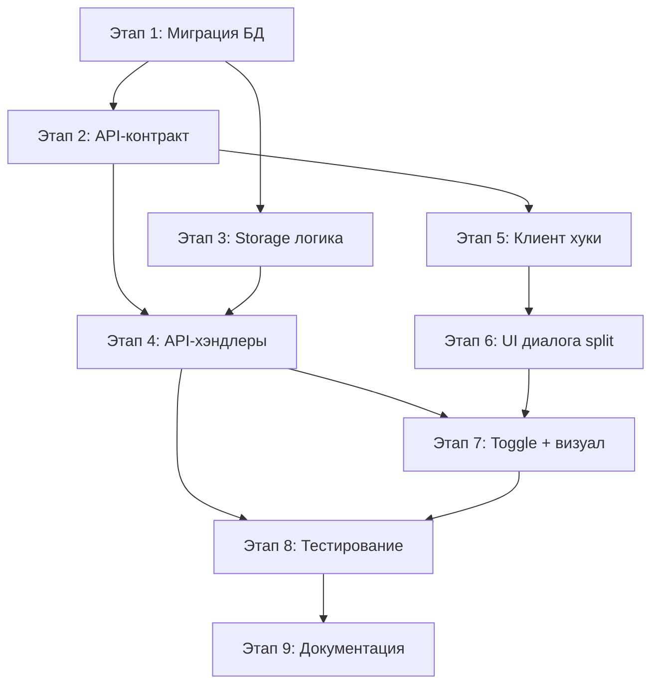

# Tasktracker 3 — Разделение задачи графика (Split Task)

> **Цель**: Позволить пользователю разделить задачу графика (полосу Ганта) на две и более последовательных задач ("захватки") с независимыми сроками и актами. Материалы/документация наследуются при разделении по выбору и синхронизируются по toggle-режиму при добавлении новых.

> **Статус**: ✅ **Завершена** (2026-03-02)  
> **Приоритет**: Высокий (бизнес-функциональность)  
> **Отчёт**: `docs/split-task-implementation-report.md`

---

## Бизнес-требования

### Разделение задачи
- Пользователь выбирает задачу графика и разбивает её на две последовательные задачи
- Дата разделения задаёт границу между частями
- Объём (`quantity`) распределяется вручную
- Каждая часть получает свой `actNumber` → генерирует свой акт со своими сроками
- Множественное разделение: уже разделённая задача может быть разделена снова (N захваток)

### Наследование при разделении
При разделении пользователь выбирает, какие данные копировать во вторую часть:
- ☑/☐ Материалы (`task_materials`)
- ☑/☐ Проектная документация (`projectDrawings`)
- ☑/☐ Нормативные ссылки (`normativeRefs`)
- ☑/☐ Исполнительные схемы (`executiveSchemes`)

### Toggle "Независимые материалы" (`independentMaterials`)
Влияет на поведение при **добавлении/удалении** материалов И документации после разделения:

- **Галочка ВЫКЛ** (`independentMaterials = false`, по умолчанию):
  - Добавление материала/документации в эту задачу → автоматически добавляется во все задачи той же `splitGroupId` с `independentMaterials = false`
  - Удаление — аналогично каскадирует
  - "Общие" материалы на все захватки

- **Галочка ВКЛ** (`independentMaterials = true`):
  - Добавление/удаление затрагивает только эту конкретную задачу
  - "Свои" материалы для этой захватки

- Toggle отображается только для задач с `splitGroupId IS NOT NULL`

### Документация (`projectDrawings`, `normativeRefs`, `executiveSchemes`) — тот же toggle
- Если `independentMaterials = false` → при изменении `projectDrawings`/`normativeRefs`/`executiveSchemes` значение обновляется во всех задачах группы с `false`
- Если `independentMaterials = true` → изменения только в этой задаче

### Генерация актов
- Без изменений в существующей логике `generate-acts`
- Каждая задача-захватка имеет свой `actNumber` → группируется в свой акт
- Даты акта (`dateStart`/`dateEnd`) вычисляются из дат задач — работает корректно

---

## Целевая модель данных

### Новые поля в `schedule_tasks`

| Колонка | Тип | Описание |
|---------|-----|----------|
| `split_group_id` | `TEXT`, nullable | UUID, связывающий задачи-сиблинги. `null` = задача не разделена |
| `split_index` | `INTEGER`, nullable | Порядок внутри группы (0, 1, 2…). Для сортировки и отображения "1/3", "2/3" |
| `independent_materials` | `BOOLEAN NOT NULL DEFAULT FALSE` | Toggle: `true` = изолированные материалы/документация, `false` = синхронизация по группе |

### Пример состояния после двойного разделения

```
Исходная задача: "Бетонирование фундамента" (100 м³, 01.03 → 30.03)

Split #1 на дату 16.03:
  Задача A: 60 м³, 01.03-15.03, splitGroupId="abc", splitIndex=0, actNumber=5
  Задача B: 40 м³, 16.03-30.03, splitGroupId="abc", splitIndex=1, actNumber=6

Split #2 (задачу B на 23.03):
  Задача A: 60 м³, 01.03-15.03, splitGroupId="abc", splitIndex=0, actNumber=5
  Задача B: 25 м³, 16.03-22.03, splitGroupId="abc", splitIndex=1, actNumber=6
  Задача C: 15 м³, 23.03-30.03, splitGroupId="abc", splitIndex=2, actNumber=7
```

---

## Этапы реализации

---

### Этап 1: Миграция БД — новые поля в `schedule_tasks`
- **Статус**: 🔲 Не начата
- **Файлы**: `shared/schema.ts`, `migrations/00XX_add_split_fields.sql`
- **Оценка**: 1-2 часа
- **Зависимости**: нет

#### Шаги:
- [ ] 1.1. Написать SQL-миграцию `migrations/00XX_add_split_fields.sql`:
  ```sql
  ALTER TABLE schedule_tasks
    ADD COLUMN split_group_id TEXT,
    ADD COLUMN split_index INTEGER,
    ADD COLUMN independent_materials BOOLEAN NOT NULL DEFAULT FALSE;

  CREATE INDEX schedule_tasks_split_group_idx
    ON schedule_tasks (split_group_id)
    WHERE split_group_id IS NOT NULL;

  COMMENT ON COLUMN schedule_tasks.split_group_id IS
    'UUID linking sibling tasks created by splitting. NULL = never split.';
  COMMENT ON COLUMN schedule_tasks.split_index IS
    'Order within split group (0, 1, 2...). NULL if not split.';
  COMMENT ON COLUMN schedule_tasks.independent_materials IS
    'When TRUE, materials/docs are managed independently. When FALSE, synced across split group.';
  ```
- [ ] 1.2. Обновить `shared/schema.ts` — добавить три колонки в `scheduleTasks`:
  ```typescript
  splitGroupId: text("split_group_id"),
  splitIndex: integer("split_index"),
  independentMaterials: boolean("independent_materials").notNull().default(false),
  ```
- [ ] 1.3. Обновить индекс `scheduleTasks` (добавить `splitGroupIdx`)
- [ ] 1.4. Обновить Zod-типы `InsertScheduleTask` / `ScheduleTask` (автоматически через `createInsertSchema`)
- [ ] 1.5. Применить миграцию: `npm run db:migrate`
- [ ] 1.6. Проверить: таблица имеет новые колонки, существующие задачи получили `split_group_id = NULL`, `independent_materials = FALSE`

#### Результат этапа:
- Новые колонки в БД, обратно совместимы (nullable / default)
- Drizzle-схема синхронизирована

---

### Этап 2: API-контракт — определение маршрутов в `shared/routes.ts`
- **Статус**: 🔲 Не начата
- **Файлы**: `shared/routes.ts`
- **Оценка**: 1-2 часа
- **Зависимости**: Этап 1

#### Шаги:
- [ ] 2.1. Добавить маршрут `scheduleTasks.split`:
  ```typescript
  split: {
    method: 'POST',
    path: '/api/schedule-tasks/:id/split',
    input: z.object({
      splitDate: z.string(),                      // ISO date, строго внутри диапазона задачи
      quantityFirst: z.string().optional(),        // объём для первой части
      quantitySecond: z.string().optional(),       // объём для второй части
      newActNumber: z.number().int().optional(),   // actNumber для новой задачи (null = не назначен)
      inherit: z.object({
        materials: z.boolean(),
        projectDrawings: z.boolean(),
        normativeRefs: z.boolean(),
        executiveSchemes: z.boolean(),
      }),
    }),
    responses: {
      200: z.object({
        original: scheduleTaskSchema,
        created: scheduleTaskSchema,
      }),
      400: z.object({ message: z.string() }),      // splitDate вне диапазона, некорректный объём
      404: z.object({ message: z.string() }),      // задача не найдена
      409: z.object({ message: z.string() }),      // конфликт actNumber
    },
  }
  ```
- [ ] 2.2. Расширить `scheduleTasks.patch` input — добавить `independentMaterials: z.boolean().optional()`
- [ ] 2.3. Добавить query-маршрут для получения сиблингов (опционально):
  ```typescript
  splitSiblings: {
    method: 'GET',
    path: '/api/schedule-tasks/:id/split-siblings',
    responses: {
      200: z.array(scheduleTaskSchema),
      404: z.object({ message: z.string() }),
    },
  }
  ```
- [ ] 2.4. Убедиться, что `scheduleTaskSchema` (ответы) включает новые поля (`splitGroupId`, `splitIndex`, `independentMaterials`)

#### Результат этапа:
- Типизированный контракт API для split, patch, siblings

---

### Этап 3: Storage — серверная логика разделения
- **Статус**: 🔲 Не начата
- **Файлы**: `server/storage.ts`
- **Оценка**: 3-4 часа
- **Зависимости**: Этап 1

#### Шаги:
- [ ] 3.1. Метод `splitScheduleTask(taskId, params)` в `DatabaseStorage`:
  ```
  Алгоритм:
  1. Получить исходную задачу (404 если нет)
  2. Валидация:
     - splitDate > startDate И splitDate < startDate + durationDays
     - sum(quantityFirst + quantitySecond) == task.quantity (если оба заданы)
  3. Вычислить:
     - durationFirst = diffDays(startDate, splitDate)
     - durationSecond = originalDuration - durationFirst
  4. Определить splitGroupId:
     - Если task.splitGroupId уже есть → использовать его
     - Иначе → сгенерировать новый UUID
  5. Определить splitIndex для новой задачи:
     - SELECT MAX(split_index) FROM schedule_tasks WHERE split_group_id = ?
     - newSplitIndex = max + 1
  6. Транзакция:
     a. UPDATE исходную задачу:
        - durationDays = durationFirst
        - quantity = quantityFirst (если задано)
        - splitGroupId = splitGroupId (если было null)
        - splitIndex = 0 (если было null)
     b. Сдвинуть orderIndex для всех задач после исходной:
        - UPDATE schedule_tasks SET order_index = order_index + 1
          WHERE schedule_id = ? AND order_index > task.orderIndex
     c. INSERT новую задачу:
        - scheduleId, workId, estimatePositionId — из исходной
        - startDate = splitDate
        - durationDays = durationSecond
        - quantity = quantitySecond
        - unit = из исходной
        - orderIndex = task.orderIndex + 1
        - actNumber = newActNumber (или null)
        - actTemplateId = из исходной
        - splitGroupId = splitGroupId
        - splitIndex = newSplitIndex
        - independentMaterials = false
        - titleOverride = null (или из исходной?)
        - projectDrawings, normativeRefs, executiveSchemes — по флагам inherit
     d. Если inherit.materials = true:
        - Скопировать все task_materials исходной задачи → новая задача
        - (с новым taskId, сохранить остальные FK)
  7. Вернуть обе задачи (обновлённую + созданную)
  ```
- [ ] 3.2. Метод `getSplitSiblings(taskId)`:
  ```
  1. Получить задачу → её splitGroupId
  2. Если splitGroupId IS NULL → вернуть [task]
  3. SELECT * FROM schedule_tasks WHERE split_group_id = ? ORDER BY split_index
  ```
- [ ] 3.3. Обновить `patchScheduleTask`:
  - Добавить поддержку поля `independentMaterials` в patch
- [ ] 3.4. Метод `syncMaterialsAcrossSplitGroup(taskId, newMaterials)`:
  ```
  Вызывается при добавлении материала через PUT/POST materials, если:
    task.splitGroupId IS NOT NULL AND task.independentMaterials = false
  
  Алгоритм:
  1. Найти все задачи-сиблинги с independentMaterials = false
  2. Для каждого сиблинга (кроме текущей):
     - Проверить, есть ли уже этот материал (по projectMaterialId + batchId)
     - Если нет → INSERT в task_materials
     - Уникальность обеспечена constraint task_materials_task_material_batch_uq
  ```
- [ ] 3.5. Метод `syncMaterialDeleteAcrossSplitGroup(taskId, materialId)`:
  ```
  Аналогично — при удалении, каскадировать на сиблингов с independentMaterials = false
  ```
- [ ] 3.6. Метод `syncDocsAcrossSplitGroup(taskId, docFields)`:
  ```
  Вызывается при PATCH задачи, если:
    task.splitGroupId IS NOT NULL AND task.independentMaterials = false
    AND (изменены projectDrawings / normativeRefs / executiveSchemes)
  
  Алгоритм:
  1. Найти все задачи-сиблинги с independentMaterials = false
  2. UPDATE schedule_tasks SET projectDrawings = ?, normativeRefs = ?, executiveSchemes = ?
     WHERE id IN (siblings) AND independent_materials = false
  ```

#### Результат этапа:
- Полная серверная логика split + sync материалов/документации
- Транзакционная целостность

---

### Этап 4: API-хэндлеры — `server/routes.ts`
- **Статус**: 🔲 Не начата
- **Файлы**: `server/routes.ts`
- **Оценка**: 3-4 часа
- **Зависимости**: Этапы 2, 3

#### Шаги:
- [ ] 4.1. Хэндлер `POST /api/schedule-tasks/:id/split`:
  ```typescript
  app.post(api.scheduleTasks.split.path, ...appAuth, async (req, res) => {
    const taskId = parseInt(req.params.id);
    const input = splitInputSchema.parse(req.body);
    
    // Валидация splitDate в диапазоне задачи
    const task = await storage.getScheduleTask(taskId);
    if (!task) return res.status(404)...
    
    const taskStart = new Date(task.startDate);
    const taskEnd = addDays(taskStart, task.durationDays);
    const splitDate = new Date(input.splitDate);
    
    if (splitDate <= taskStart || splitDate >= taskEnd) {
      return res.status(400).json({ message: 'splitDate must be within task range' });
    }
    
    // Проверка конфликта actNumber
    if (input.newActNumber) {
      const conflict = await storage.getTasksByActNumber(task.scheduleId, input.newActNumber);
      // 409 если actNumber занят другой группой
    }
    
    const result = await storage.splitScheduleTask(taskId, input);
    return res.json(result);
  });
  ```
- [ ] 4.2. Хэндлер `GET /api/schedule-tasks/:id/split-siblings`
- [ ] 4.3. Обновить хэндлер `PATCH /api/schedule-tasks/:id`:
  - Поддержать `independentMaterials` в patch
  - При изменении `projectDrawings`, `normativeRefs`, `executiveSchemes`:
    - Проверить `task.splitGroupId` и `task.independentMaterials`
    - Если `splitGroupId != null && independentMaterials == false` → вызвать `syncDocsAcrossSplitGroup`
- [ ] 4.4. Обновить хэндлер `POST /api/schedule-tasks/:id/materials` (добавление материала):
  - После добавления: проверить task.splitGroupId и independentMaterials
  - Если нужно → вызвать `syncMaterialsAcrossSplitGroup`
- [ ] 4.5. Обновить хэндлер `DELETE /api/schedule-tasks/:id/materials/:materialId` (удаление):
  - Аналогично — `syncMaterialDeleteAcrossSplitGroup`
- [ ] 4.6. Обновить хэндлер `PUT /api/schedule-tasks/:id/materials` (полная замена):
  - Если `independentMaterials = false` → синхронизировать итоговый набор на сиблингов
  - **Внимание**: PUT (replace) каскадирует полный набор, не delta. Нужно аккуратно обработать:
    - Добавить недостающие материалы в сиблингов
    - Удалить из сиблингов те, что были убраны
    - Не затрагивать материалы, которые есть у сиблинга с `independentMaterials = true`

#### Результат этапа:
- API полностью функционален
- Синхронизация работает при всех операциях с материалами/документацией

---

### Этап 5: Клиент — хуки и утилиты
- **Статус**: 🔲 Не начата
- **Файлы**: `client/src/hooks/use-schedules.ts`, `client/src/hooks/use-task-materials.ts`
- **Оценка**: 2-3 часа
- **Зависимости**: Этап 2

#### Шаги:
- [ ] 5.1. Хук `useSplitScheduleTask` в `use-schedules.ts`:
  ```typescript
  export function useSplitScheduleTask(scheduleId: number) {
    const queryClient = useQueryClient();
    return useMutation({
      mutationFn: async ({ taskId, params }: { taskId: number; params: SplitTaskInput }) => {
        const res = await apiRequest('POST', `/api/schedule-tasks/${taskId}/split`, params);
        return res.json();
      },
      onSuccess: () => {
        queryClient.invalidateQueries({ queryKey: ['/api/schedules', scheduleId] });
      },
    });
  }
  ```
- [ ] 5.2. Хук `useSplitSiblings(taskId)`:
  ```typescript
  export function useSplitSiblings(taskId: number | null) {
    return useQuery({
      queryKey: ['/api/schedule-tasks', taskId, 'split-siblings'],
      queryFn: () => apiRequest('GET', `/api/schedule-tasks/${taskId}/split-siblings`).then(r => r.json()),
      enabled: !!taskId,
    });
  }
  ```
- [ ] 5.3. Обновить `usePatchScheduleTask`:
  - Убедиться, что `independentMaterials` передаётся в patch
  - Инвалидация siblings при patch задачи из split-группы (при sync docs)
- [ ] 5.4. Обновить типы `ScheduleTask` на клиенте (если определены отдельно от shared):
  - Добавить `splitGroupId`, `splitIndex`, `independentMaterials`

#### Результат этапа:
- React Query хуки для split API
- Типы синхронизированы

---

### Этап 6: Клиент — UI диалога разделения
- **Статус**: 🔲 Не начата
- **Файлы**: `client/src/pages/Schedule.tsx`, новый компонент `client/src/components/schedule/SplitTaskDialog.tsx`
- **Оценка**: 4-6 часов
- **Зависимости**: Этап 5

#### Шаги:
- [ ] 6.1. Создать компонент `SplitTaskDialog.tsx`:
  ```
  Props: { task: ScheduleTask; open: boolean; onClose: () => void; scheduleId: number }
  
  UI элементы:
  ┌─────────────────────────────────────────────┐
  │  Разделение задачи                          │
  │  "Бетонирование фундамента"                 │
  │                                             │
  │  Дата разделения:                           │
  │  [   DatePicker: 16.03.2026   ]             │
  │  (валидация: между startDate и endDate)      │
  │                                             │
  │  Распределение объёма (100 м³):             │
  │  Часть 1: [ Input: 60 ] м³                 │
  │  Часть 2: [ Input: 40 ] м³  (авто-остаток) │
  │                                             │
  │  Номер акта для части 2: [ Input: 6 ]       │
  │                                             │
  │  Наследование во вторую часть:              │
  │  ☑ Материалы                                │
  │  ☑ Проектная документация                   │
  │  ☑ Нормативные ссылки                       │
  │  ☐ Исполнительные схемы                     │
  │                                             │
  │           [Отмена]  [Разделить]             │
  └─────────────────────────────────────────────┘
  
  Логика:
  - quantitySecond автоматически = totalQuantity - quantityFirst
  - Валидация: splitDate в диапазоне, объёмы > 0
  - Submit → useSplitScheduleTask
  - Toast "Задача разделена на 2 части"
  ```
- [ ] 6.2. Добавить кнопку "Разделить" в `Schedule.tsx`:
  - Рядом с существующими кнопками задачи (ChevronLeft/Right, MoreVertical)
  - Или внутри dropdown-меню "..." (MoreVertical)
  - Иконка: `Scissors` из lucide-react
  - `onClick={() => openSplitDialog(task)}`
- [ ] 6.3. Состояние в `Schedule.tsx`:
  ```typescript
  const [splitTask, setSplitTask] = useState<ScheduleTask | null>(null);
  // ...
  <SplitTaskDialog 
    task={splitTask} 
    open={!!splitTask} 
    onClose={() => setSplitTask(null)}
    scheduleId={scheduleId}
  />
  ```
- [ ] 6.4. Обработка ошибок:
  - 400 (splitDate вне диапазона) → показать сообщение у поля даты
  - 409 (конфликт actNumber) → показать сообщение у поля номера акта

#### Результат этапа:
- Полноценный UI для разделения задачи

---

### Этап 7: Клиент — Toggle "Независимые материалы" и визуальная индикация
- **Статус**: 🔲 Не начата
- **Файлы**: `client/src/pages/Schedule.tsx`, `client/src/components/schedule/TaskMaterialsEditor.tsx`
- **Оценка**: 3-4 часа
- **Зависимости**: Этап 6

#### Шаги:
- [ ] 7.1. Toggle в диалоге редактирования задачи (`Schedule.tsx`, секция редактирования ~строки 422-673):
  - Показывать только если `task.splitGroupId != null`
  - Switch/Checkbox: "Независимые материалы и документация"
  - Tooltip: "Если выключено — добавленные материалы и документация автоматически применяются ко всем захваткам этой задачи"
  - onChange → `patchTask({ independentMaterials: value })`
- [ ] 7.2. Badge "захватка X из Y" на задаче в списке:
  - Если `task.splitGroupId != null`:
    - Определить позицию: `task.splitIndex + 1` из `N` (общее кол-во сиблингов)
    - Показать badge: `<Badge variant="outline">1/3</Badge>` рядом с названием
  - Для определения N: подсчитать задачи с тем же `splitGroupId` в общем массиве `tasks`
- [ ] 7.3. Визуальная связь на Ганте:
  - Задачи одной `splitGroupId` — одинаковый цвет полосы (генерировать из hash `splitGroupId`)
  - Между полосами — пунктирная линия-коннектор (SVG или CSS `::after`)
  - При наведении на одну полосу — подсветить все сиблинги
- [ ] 7.4. Индикатор режима материалов:
  - В `TaskMaterialsEditor`:
    - Если `independentMaterials = false` → показать пометку: "Материалы синхронизируются с N захваткам(и)"
    - Если `independentMaterials = true` → показать: "Материалы только для этой захватки"
- [ ] 7.5. Аналогичная пометка для полей документации:
  - В секциях `projectDrawings`, `normativeRefs`, `executiveSchemes`:
    - Если task в split-группе и `independentMaterials = false` → "Изменения применятся ко всем захваткам"

#### Результат этапа:
- UX понятен пользователю: видно связь между захватками
- Toggle управляет режимом синхронизации
- Информативные подсказки при редактировании

---

### Этап 8: Тестирование и edge cases
- **Статус**: 🔲 Не начата
- **Файлы**: (ручное тестирование + при необходимости автотесты)
- **Оценка**: 2-3 часа
- **Зависимости**: Этапы 4, 7

#### Сценарии для проверки:
- [ ] 8.1. **Базовый split**: задача без split → разделить → две задачи с правильными датами, объёмами, orderIndex
- [ ] 8.2. **Множественный split**: разделить уже разделённую задачу → 3 захватки, правильные splitIndex (0,1,2)
- [ ] 8.3. **Наследование**: split с inherit.materials=true → материалы скопированы; false → пустые
- [ ] 8.4. **Sync материалов (toggle OFF)**: добавить материал в захватку 1 → появляется в захватках 2,3 (если toggle OFF у всех)
- [ ] 8.5. **Sync материалов (toggle ON у одной)**: добавить материал в захватку 1 (OFF) → появляется в захватке 2 (OFF), НЕ появляется в захватке 3 (ON)
- [ ] 8.6. **Удаление материала (toggle OFF)**: удалить из захватки 1 → удаляется из всех с OFF
- [ ] 8.7. **Sync документации (toggle OFF)**: изменить projectDrawings в захватке 1 → обновляется у сиблингов с OFF
- [ ] 8.8. **Независимая документация (toggle ON)**: изменить normativeRefs в захватке с ON → не затрагивает других
- [ ] 8.9. **Переключение toggle**: задача с toggle OFF → переключить на ON → дальнейшие добавления не синхронизируются; существующие материалы НЕ удаляются
- [ ] 8.10. **Генерация актов**: 3 захватки с разными actNumber → 3 отдельных акта, каждый со своими датами, своими материалами
- [ ] 8.11. **orderIndex**: после split задачи в середине графика → orderIndex корректно сдвинуты, порядок не нарушен
- [ ] 8.12. **Конфликт actNumber**: split с уже занятым actNumber → 409, понятное сообщение
- [ ] 8.13. **Edge: split задачи с duration=1**: должен быть отклонён (нельзя разделить 1-дневную задачу)
- [ ] 8.14. **Edge: объём = 0 у одной части**: допустимо? (предлагаю: запретить, минимум 0.0001)

#### Результат этапа:
- Все сценарии проверены
- Edge cases обработаны корректно

---

### Этап 9: Документация
- **Статус**: 🔲 Не начата
- **Файлы**: `docs/project.md`, `docs/changelog.md`
- **Оценка**: 1-2 часа
- **Зависимости**: Этап 8

#### Шаги:
- [ ] 9.1. Обновить `docs/project.md`:
  - Раздел "Модель данных": описать `split_group_id`, `split_index`, `independent_materials`
  - Раздел "Контракт API": добавить `POST /api/schedule-tasks/:id/split`, `GET .../split-siblings`
  - Раздел "Ключевые сценарии": описать разделение задач и toggle-режим
- [ ] 9.2. Добавить запись в `docs/changelog.md`
- [ ] 9.3. Обновить `docs/tasktracker.md` — ссылка на этот tasktracker

#### Результат этапа:
- Документация актуальна
- Changelog содержит запись о фиче

---

## Порядок выполнения и зависимости



- **Этапы 2 и 3** можно делать параллельно (после этапа 1)
- **Этап 5** зависит только от контракта (этап 2)
- **Этапы 6 и 4** можно частично параллелить
- **Этап 8** — только после полной реализации backend (4) и frontend (7)

---

## Оценка трудозатрат

| Этап | Оценка | Сложность |
|------|--------|-----------|
| Этап 1: Миграция БД | 1-2 ч | Низкая |
| Этап 2: API-контракт | 1-2 ч | Низкая |
| Этап 3: Storage логика | 3-4 ч | Высокая (транзакции, sync) |
| Этап 4: API-хэндлеры | 3-4 ч | Средняя |
| Этап 5: Клиент хуки | 2-3 ч | Низкая |
| Этап 6: UI диалога split | 4-6 ч | Средняя (валидация, UX) |
| Этап 7: Toggle + визуал | 3-4 ч | Средняя (Gantt визуализация) |
| Этап 8: Тестирование | 2-3 ч | Средняя |
| Этап 9: Документация | 1-2 ч | Низкая |
| **Итого** | **~20-30 ч** | — |

---

## Риски и митигация

| Риск | Вероятность | Митигация |
|------|-------------|-----------|
| Рассинхрон материалов при гонке запросов | Средняя | Транзакции в storage; уникальный constraint на task_materials |
| Сложность UI при > 3 захватках | Низкая | Горизонтальная полоса-группа + коллапс; начать с UX для 2-3 |
| Переключение toggle при существующих материалах | Средняя | При переключении OFF→ON: оставить текущие; ON→OFF: предложить синхронизацию |
| Производительность sync на большом кол-ве сиблингов | Низкая | Обычно 2-5 захваток; batch-операции в транзакции |
| Конфликт с generate-acts при пересекающихся actNumber | Низкая | Валидация при split; unique warning при генерации |

---

## Критерии приёмки (Definition of Done)

1. [ ] Пользователь может разделить задачу на 2+ последовательных части через UI
2. [ ] Каждая часть имеет независимые сроки и номер акта
3. [ ] Генерация актов создаёт отдельный акт для каждой захватки
4. [ ] При разделении материалы/документация наследуются по выбору
5. [ ] Toggle "Независимые материалы" работает:
   - OFF → добавление/удаление материалов и изменение документации синхронизируется по группе
   - ON → изменения только в текущей задаче
6. [ ] UI показывает связь между захватками (badge, цвет, коннекторы)
7. [ ] Edge cases обработаны (1-дневная задача, нулевой объём, конфликт actNumber)
8. [ ] Документация обновлена
